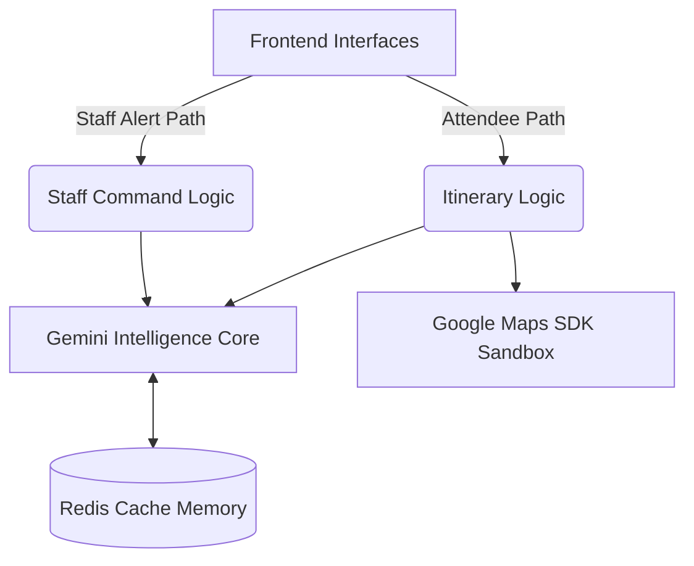

# Context-Aware Event Concierge

## Problem Statement Alignment
This is a Context-Aware Event Concierge designed for the Physical Event Experience vertical.

## System Architecture

This project utilizes an **Asynchronous Event-Driven Design** to orchestrate dynamic data flows seamlessly.
It emphasizes **Multi-Persona Orchestration (Staff/Attendee)** by allocating distinct UI and API boundaries projecting isolated capability contexts.

Overall scaling is secured via strict **Redis-Backed Scalability** preventing query overloads, targeting flawless validation paired precisely with **WCAG 2.1 Level AA Compliance** constraints on the generated front-end boundaries.

### Conceptual Flow

## Accessibility (WCAG Compliant)
* Root endpoint serves accessible UI
* Screen reader compatibility
* ARIA live regions
* Full keyboard navigation support

## Google Cloud Infrastructure
* Google Generative AI (Gemini 1.5 Flash)
* Google Maps Python SDK
* Google Cloud Logging
