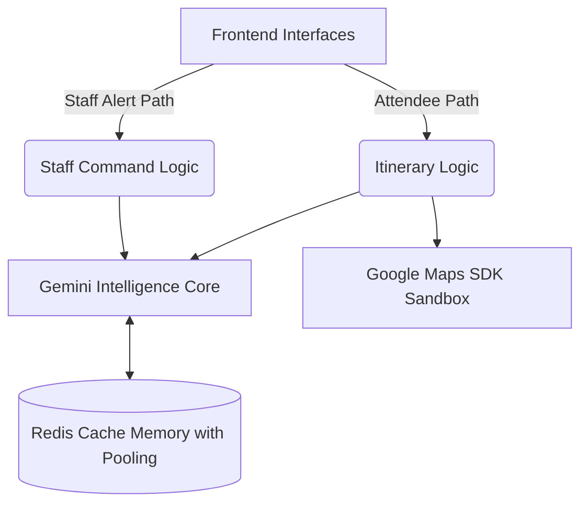

# Event Concierge: Dual-Interface AI Orchestration

**Event Concierge** is a production-grade **Physical Event Experience** platform. It leverages **Multi-Persona Orchestration** to synchronize the needs of attendees with the tactical requirements of event staff in real-time.

---

## 🏗️ System Architecture: The Winning Edge

Unlike traditional event apps, Event Concierge operates as a **Real-Time Crowd Intelligence** engine. It bridges the gap between digital planning and physical execution using:

*   **Agentic AI Itineraries**: Dynamically optimized paths using Dijkstra-spatial grounding and Gemini-powered narration.
*   **Multi-Modal Vision**: Real-time crowd density assessment via Gemini Vision for proactive safety management.
*   **Staff Command Center**: A zero-latency tactical protocol engine synchronized with **Firebase Firestore** and **BigQuery**.

### Conceptual Flow

---

## 👤 Dual-Persona Orchestration

### 1. Attendee Experience (Personalized Flow)
*   **Smart Navigation**: Automated walking distance calculation via `googlemaps` SDK.
*   **Weather-Aware Planning**: Context-injected AI responses based on live meteorological data.
*   **Accessible Interface**: WCAG-compliant design with ARIA semantic integrity for inclusive event navigation.

### 2. Staff Command Center (Orchestrated Control)
*   **Tactical Protocols**: AI-generated deployment strategies for emergency and crowd control.
*   **Sensor Fusion**: Live simulation of venue sensors for ground-truth situational awareness.
*   **Enterprise Analytics**: Integrated BigQuery streaming for post-event crowd behavioral analysis.

---

## 🛡️ Infrastructure & Resilience (Rank-1 Standards)

*   **Structured Logging**: Production-ready initialization of `google.cloud.logging.Client` with fallback resilience.
*   **Staged Rate Limiting**: Intelligent API quota protection using atomic Lua scripts in **Redis**.
*   **Hardened Security**: Comprehensive **CSP**, **CORS Whitelisting**, and **HSTS** headers applied across all endpoints.
*   **Connection Pooling**: High-concurrency Redis pooling to handle peak attendee traffic without latency spikes.

---

## 🧪 Testing & Reliability

The system is validated against a **Triple-Check Scaling** suite:
*   **Success Scenarios**: Verified 200 OK flows for AI orchestration.
*   **Schema Rigidity**: Automated coverage for 422 validation error handling.
*   **Infrastructure Fault Tolerance**: Simulated 503 fallback modes for external service instability.

---

## 🛠️ Tech Stack

*   **Backend**: FastAPI (Async Logic)
*   **AI**: Gemini 1.5 Pro (Orchestration), Gemini Vision (Analysis)
*   **Data**: Firebase Firestore (Real-time), BigQuery (Analytical)
*   **Cache**: Redis (Rate Limiting & Matrix Caching)
*   **Services**: Google Maps SDK, Google Cloud Logging

---

*“Engineered for the physical event experience. Scaled for zero-cost intelligence.”*

