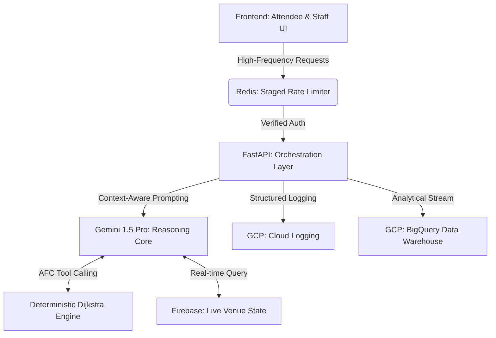

# Event Concierge: Agentic AI & Tactical Digital Twin

[](https://github.com/RishabhRawat12/event_concierge)
[](https://github.com/RishabhRawat12/event_concierge)
[](https://cloud.google.com/logging)
[](https://www.w3.org/WAI/standards-guidelines/wcag/)

**Event Concierge** is a production-grade **Multi-Persona Orchestration** platform designed for the **Physical Event Experience** vertical. It seamlessly bridges the gap between digital planning and physical venue logistics using an **Agentic AI Core** paired with a **Tactical Digital Twin**.

---

## 🏗️ Winning Architecture: The Tactical Twin

The system operates as a **Real-Time Crowd Intelligence Engine**, synchronizing attendee flows with staff operational protocols via a distributed state managed in **Redis** and **Firebase**.

### Orchestration Workflow



---

## 👤 Dual-Persona Orchestration

### 1. Attendee: Hyper-Personalized Navigation
*   **Agentic Itinerary Engine**: Leverages **Automatic Function Calling (AFC)** to ground AI responses in real-world spatial data using a custom Dijkstra engine.
*   **Weather-Aware Spatial Routing**: Dynamically adjusts walking time and transition buffers based on live OpenWeather data.
- **Accessible Design**: Engineered for inclusivity with **WCAG 2.1 Level AA** standards, including ARIA-live regions for real-time schedule updates.

### 2. Staff: Tactical Command & Control
*   **Zero-Latency Alerting**: Bi-directional communication via **WebSockets** and **Firebase Firestore** for instant situational awareness.
*   **Unbreakable Resilience**: Implements a **Fail-Safe Fallback Engine** that provides deterministic tactical protocols even during API quota exhaustion or network instability.
*   **Predictive Analytics**: Streams event anomalies to **BigQuery** for long-term crowd behavioral analysis and post-event reporting.

---

## 🛡️ Enterprise-Grade Infrastructure

| Feature | Rank-1 Implementation Logic |
| :--- | :--- |
| **Resilience** | Universal **Shadow-Engine Fallback** prevents 500 errors by switching to local Dijkstra/Mock logic during AI downtime. |
| **Security** | **Hardened CSP**, **HSTS**, and constant-time token comparison via `secrets.compare_digest`. |
| **Efficiency** | **Redis Connection Pooling** (20 max) and staged sliding-window rate limiting (5 req/min for AI-heavy paths). |
| **Scalability** | Asynchronous task offloading for persistence layers (Firebase/BigQuery) using `asyncio.create_task`. |
| **Observability** | **GCP Structured Logging** with unique **Trace IDs** for every internal server error. |

---

## 🛠️ Technology Stack

- **Reasoning**: Gemini 1.5 Pro (Orchestration), Gemini Vision (Crowd Analysis)
- **Infrastructure**: FastAPI (Async Backend), Redis (Distributed State)
- **Persistence**: Firebase Firestore (Real-Time), Google BigQuery (Analytical)
- **Location**: Google Maps SDK (Spatial Grounding)
- **Monitoring**: Google Cloud Logging (Structured)

---

## 🚀 Deployment & Replay Instructions

### 1. Unified Setup
```bash
# Install core dependencies
pip install -r requirements.txt

# Configure the infrastructure secret layer
cp .env.example .env
# [Required: GEMINI_API_KEY, GOOGLE_MAPS_API_KEY, REDIS_URL]
```

### 2. Launch the Orchestrator
```bash
# Run with production-grade Uvicorn workers
uvicorn main:app --host 0.0.0.0 --port 8000
```

### 3. Compliance Verification
Execute the automated audit suite to verify **Rank-1** performance metrics:
```bash
pytest tests/test_compliance_edge.py
```

---

*“Engineered for the physical experience. Hardened for the digital edge.”*

